# Pixoo Canvas — Home Assistant integration for the Divoom Pixoo 64

[](https://github.com/hacs/integration)

*[Lire en français](README.md)*

Home Assistant integration (custom component, HACS-compatible) to control a Divoom
Pixoo 64 from Home Assistant: power/brightness, and above all a custom **page** system
displaying your sensors, text and images, with automatic rotation between them. Inspired
by [gickowtf/pixoo-homeassistant](https://github.com/gickowtf/pixoo-homeassistant).

## Table of contents

- [Installation](#installation)
- [Basic configuration](#basic-configuration)
- [What you get](#what-you-get)
- [Pages](#pages)
  - [Page: Components (your own design)](#page-components-your-own-design)
  - [Page: Clock (native clock)](#page-clock-native-clock)
  - [Page: Channel (custom Divoom channel)](#page-channel-custom-divoom-channel)
  - [Page: Visualizer (audio visualizer)](#page-visualizer-audio-visualizer)
  - [Page: Sound meter](#page-sound-meter)
  - [Page: PV (solar)](#page-pv-solar)
  - [Page: Fuel (gas station)](#page-fuel-gas-station)
  - [Page: Pihole (ad blocker)](#page-pihole-ad-blocker)
  - [Page: Weather](#page-weather)
  - [Page: Battery (generic charge gauge)](#page-battery-generic-charge-gauge)
- [Automatic page rotation](#automatic-page-rotation)
- [Service: render a page on demand](#service-render-a-page-on-demand)
- [Service: sound the buzzer](#service-sound-the-buzzer)
- [Service: reboot the device](#service-reboot-the-device)
- [Service: timer (start_timer / stop_timer)](#service-timer-start_timer--stop_timer)
- [Service: stopwatch (start_stopwatch / pause_stopwatch / stop_stopwatch / reset_stopwatch)](#service-stopwatch-start_stopwatch--pause_stopwatch--stop_stopwatch--reset_stopwatch)
- [Service: audio visualizer (start_visualizer / stop_visualizer)](#service-audio-visualizer-start_visualizer--stop_visualizer)
- [Service: sound meter (start_sound_meter / stop_sound_meter)](#service-sound-meter-start_sound_meter--stop_sound_meter)
- [License](#license)

## Installation

This integration is officially listed in HACS (Home Assistant Community Store).

[](https://my.home-assistant.io/redirect/hacs_repository/?owner=infernalK&repository=ha-pixoo-canvas&category=integration)

<details>
    <summary>Click here for detailed instructions</summary>
    <ol>
        <li>Installation</li>
        <ul>
            <li>
                <u>Via HACS</u><br />
                <ol>
                    <li>Click the badge above (opens the repository page directly in HACS), or open HACS manually and go to Integrations.</li>
                    <li>Search for "Pixoo Canvas" if you didn't use the badge.</li>
                    <li>Click the result, then click "Download".</li>
                </ol>
            </li>
            <li>
                <u>Manually</u><br />
                Download the <a href="https://github.com/infernalK/ha-pixoo-canvas/releases">latest release</a> as a ZIP and extract it into the <code>custom_components</code> directory of your HA config.
            </li>
        </ul>
        <li>Restart HA so it loads the integration.</li>
        <li>Go to 'Settings > Devices & services' and click the blue '+ Add integration' button. Search for 'Pixoo Canvas' and select it.</li>
    </ol>
</details>

## Basic configuration

**Settings → Devices & services → Add integration → Pixoo Canvas.**

If a Pixoo is detected on your network, pick it from the list (or "Enter IP manually"
otherwise). Once added, click **Configure** on the Pixoo Canvas card to set:

| Setting | Description |
| --- | --- |
| IP address | Can be changed later if your Pixoo's IP changes. |
| Default page duration | How long each page stays on screen during automatic rotation, unless it sets its own `duration` (see [Automatic rotation](#automatic-page-rotation)). |
| Pages (YAML) | Your list of pages — see [Pages](#pages) below. |

Every save tests the connection to the device before applying the changes.

## What you get

Once the integration is configured, you get access to:

- `switch.pixoo_screen_power` — turn the screen on/off.
- `light.pixoo_brightness` — adjust brightness.
- `switch.pixoo_page_rotation` — enable/disable automatic page rotation.
- `switch.pixoo_mirror_mode` — horizontal mirror of the screen.
- `select.pixoo_screen_orientation` — physical screen orientation (0°/90°/180°/270°),
  set according to how your frame is mounted.
- `button.pixoo_reboot` — reboot the device with one tap (equivalent to the
  `pixoo_canvas.reboot_device` service, see below). A button rather than a switch: a
  reboot has no persistent on/off state to reflect.
- `switch.pixoo_channel_faces` / `channel_cloud` / `channel_visualizer` / `channel_custom`
  — one switch per top-level channel of the device (the clock, the Divoom Cloud feed,
  the audio visualizer, or your custom channels), radio-button style: turning one on
  implicitly turns the other 3 off. Turning off the one that's already active does
  nothing — there's no "no channel" state. Like `start_timer`/`start_stopwatch`,
  turning on a channel pauses `switch.pixoo_page_rotation` if it was running; turning it
  off resumes it, only if it was this switch that had paused it.
  > ⚠️ These switches only reflect the last channel activated *via this switch* — not
  > necessarily what's actually displayed at any given moment (use
  > `sensor.pixoo_active_channel` for that).
- `sensor.pixoo_active_channel` — the channel actually active on the device right now
  (Faces/Cloud/Visualizer/Custom), kept up to date even if the change came from
  somewhere other than Home Assistant (Divoom app, remote).
- 2 other diagnostic sensors (rotation indicator, ID of the displayed clock) — useful
  for troubleshooting, not for everyday use.
- `sensor.pixoo_device_id` — a diagnostic sensor whose state is this device's Home
  Assistant `device_id`, the one expected by every `pixoo_canvas.*` service
  (`render_page`, `play_buzzer`, `reboot_device`, `start_timer`, `stop_timer`). Handy
  for building an iOS/Android shortcut without having to dig it out of the device's URL
  under Settings → Devices.

## Pages

A **page** is a YAML block with at minimum a `name`. The `page_type` field determines
how it's rendered — if absent, it's `components` (your own design, see below). Paste
your pages into the **Pages (YAML)** options field, as a list:

```yaml
- name: My first page
  page_type: components   # optional, this is the default
  components:
    - type: text
      position: [2, 2]
      content: "Hello!"
```

**Fields common to all pages**, regardless of `page_type`:

| Field | Required | Default | Values |
| --- | :---: | :---: | --- |
| `name` | Yes | | Page name (used to call it via the `render_page` service). |
| `page_type` | No | `components` | `components`, `clock`, `channel`, `visualizer`, `sound_meter`, `pv`, `fuel`, `pihole`, `weather`, `battery`. |
| `enabled` | No | enabled | `true`/`false` or a `{{ }}` template — disabled pages are skipped by rotation. |
| `duration` | No | (the global setting) | Seconds displayed before moving to the next page, during rotation. |
| `scan_interval` | No | | Seconds between refreshes while the page is displayed (useful for frequently-changing values). |

```yaml
- name: Spa
  enabled: "{{ states('input_boolean.spa_active') }}"
  duration: 20
  scan_interval: 10
  page_type: components
  components: [...]
```

If you're just starting out, begin with a `components` page: it's the most flexible,
and the other types (`clock`, `channel`, `visualizer`, `sound_meter`, `pv`, `fuel`) work
exactly the same way once you've got the hang of it.

### Page: Components (your own design)

The Pixoo becomes your canvas: you stack **components** (text, image, rectangle...) at
precise positions on a 64×64 pixel screen. `(0, 0)` is the top-left corner, `(63, 63)`
the bottom-right corner.

```yaml
- name: Temperatures
  page_type: components
  components:
    - type: rectangle
      position: [0, 0]
      size: [64, 64]
      color: black
    - type: text
      position: [2, 2]
      content: "{{ states('sensor.living_room_temperature') }}°C"
      color: white
```

#### Component: `text`

By default, the text is drawn once into the image buffer (static). With `scroll: true`,
it scrolls instead, natively animated by the screen (not by us) — useful for a message
longer than the screen.

⚠️ **In `scroll: true` mode, `font`/`font_size` (our bitmap fonts) are ignored.** The
text is then no longer drawn by the integration: it's sent as-is to the Pixoo's
firmware (`Draw/SendHttpText`), which animates and renders it itself with one of its
native fonts (`divoom_font`, 0-7 — see the preview below). Our bitmap fonts can't be
applied on this path: it's the device that draws the pixels, not us.

| Field | Required | Default | Values |
| --- | :---: | :---: | --- |
| `position` | Yes | | `[x, y]` |
| `content` | Yes | | Text, with support for `{{ }}` templates and line breaks. |
| `color` | No | `white` | `[R, G, B]` or a color name — see [Colors](#colors). |
| `align` | No | `left` | `left`, `center`, `right`. |
| `font` | No | `pico_8` | Bitmap font — see [Fonts](#fonts) below. Ignored if `scroll: true`. |
| `font_size` | No | `1` | Integer scale factor for the bitmap font. Ignored if `scroll: true`. |
| `scroll` | No | `false` | `true` for native (hardware) scrolling instead of a static draw. |

The following fields are only used when `scroll: true`:

| Field | Required | Default | Values |
| --- | :---: | :---: | --- |
| `scroll_direction` | No | `left` | `left`, `right` |
| `scroll_speed` | No | `100` | Milliseconds per step — smaller = faster. |
| `text_width` | No | `64` | Width of the scrolling area in pixels. |
| `divoom_font` | No | `0` | Pixoo's native font (0-7), used by the firmware to render the scrolling text. |
| `text_id` | No | | Slot identifier (0-19), to overlay several scrolling texts. |

**Native font preview (`divoom_font`)**, photographed on a real device (Pixoo 64):

| `divoom_font` | Preview | Size (W×H, px) | Observed style |
| :---: | --- | :---: | --- |
| `0` | 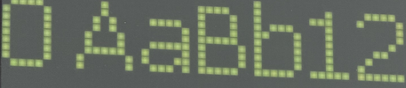 | 10×7 | Thin strokes, distinct upper/lowercase — the plainest. |
| `1` | 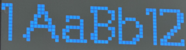 | 11×10 | Large and bold, the tallest. |
| `2` | 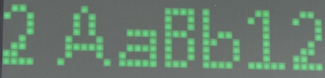 | 8×7 | The most compact/condensed. |
| `3` | 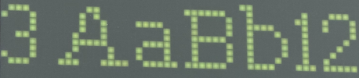 | 10×10 | Same width as `0` but noticeably taller. |
| `4` | 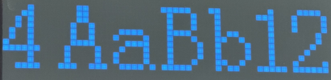 | 11×8 | Large and bold, a bit less tall than `1`. |
| `5` | 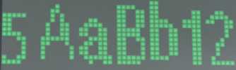 | 13×9 | The widest, blocky. |
| `6` | 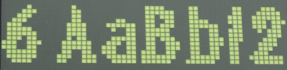 | 13×8 | As wide as `5`, slanted/dynamic style. |
| `7` | 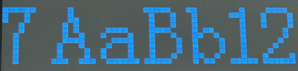 | 11×8 | Large, upright, clean, sans-serif — very readable. |

#### Component: `image`

| Field | Required | Default | Values |
| --- | :---: | :---: | --- |
| `position` | Yes | | `[x, y]` |
| `image_url` or `image_path` | Yes (one of the two) | | URL (or `{{ }}` template) or local path, e.g. `/config/www/logo.png`. |

> **Getting an "is not an allowed external URL" warning?**
> Home Assistant blocks images from external URLs that aren't explicitly allow-listed by
> default — this is a core HA safeguard, not specific to this integration. Add the URL (or
> its domain/IP) to `allowlist_external_urls` in `configuration.yaml`, then restart Home
> Assistant:
> ```yaml
> homeassistant:
>   allowlist_external_urls:
>     - "http://192.168.1.200:6942/"
> ```

#### Component: `rectangle`

| Field | Required | Default | Values |
| --- | :---: | :---: | --- |
| `position` | Yes | | `[x, y]` |
| `size` | Yes | | `[width, height]` |
| `color` | No | `white` | `[R, G, B]` or a color name. |
| `filled` | No | `true` | `true` (filled) or `false` (outline only). |

#### Component: `icon`

[Material Design Icons](https://pictogrammers.com/library/mdi/) icon (with or without
the `mdi:` prefix), colored and resized — no network call, everything is bundled with
the integration.

| Field | Required | Default | Values |
| --- | :---: | :---: | --- |
| `position` | Yes | | `[x, y]` |
| `icon` | Yes | | MDI name, e.g. `mdi:thermometer` or just `thermometer`. |
| `size` | No | `16` | Size in pixels. |
| `color` | No | `white` | `[R, G, B]` or a color name. |
| `value` + `color_thresholds` | No | | Colors the icon based on a value — see below. |

#### Component: `progress_bar`

Horizontal or vertical progress bar.

| Field | Required | Default | Values |
| --- | :---: | :---: | --- |
| `position` | Yes | | `[x, y]` |
| `size` | Yes | | `[width, height]` |
| `orientation` | No | `horizontal` | `horizontal`, `vertical` |
| `transition` | No | `hard` | `hard` (crisp edge) or `smooth` (gradient at the edge) |
| `min` / `max` | No | `0` / `100` | Bounds for the value. |
| `value` | Yes | | Current value, raw or a template. |
| `background_color` | No | dark gray | `[R, G, B]` or a color name. |
| `color` + `color_thresholds` | No | green | Bar color — see below. |

**`color_thresholds`** (shared by `icon`, `progress_bar`, `line`, `circle`, `arc`,
`arrow` and `graph`): an increasing list of `{value, color}` steps. The color used is
that of the highest step still less than or equal to `value`:

```yaml
- type: progress_bar
  position: [2, 50]
  size: [60, 6]
  value: "{{ states('sensor.spa_filtration_pct') }}"
  color_thresholds:
    - value: 0
      color: red
    - value: 50
      color: orange
    - value: 90
      color: green
```

#### Component: `line`

Straight line segment with configurable thickness — separators, crosshairs,
hand-built graph bars.

| Field | Required | Default | Values |
| --- | :---: | :---: | --- |
| `start` | Yes | | `[x, y]` |
| `end` | Yes | | `[x, y]` |
| `color` | No | `white` | `[R, G, B]` or a color name. |
| `thickness` | No | `1` | Thickness in pixels. |
| `value` + `color_thresholds` | No | | Colors the line based on a value — see above. |

#### Component: `circle`

Filled or outlined circle — a landmark point, the center of a circular gauge.

| Field | Required | Default | Values |
| --- | :---: | :---: | --- |
| `center` | Yes | | `[x, y]` |
| `radius` | Yes | | Radius in pixels. |
| `color` | No | `white` | `[R, G, B]` or a color name. |
| `filled` | No | `true` | `true` (filled) or `false` (outline only). |
| `thickness` | No | `1` | Outline thickness (if `filled: false`). |
| `value` + `color_thresholds` | No | | Colors the circle based on a value — see above. |

#### Component: `arc`

Arc or pie slice — circular gauges, progress rings. Angles are measured from the top
(`0` = noon), clockwise.

| Field | Required | Default | Values |
| --- | :---: | :---: | --- |
| `center` | Yes | | `[x, y]` |
| `radius` | Yes | | Radius in pixels. |
| `start_angle` | No | `0` | Degrees, `0` = top, clockwise. Accepts a template. |
| `end_angle` | No | `90` | Degrees. Accepts a template, e.g. `{{ (value \| float) * 3.6 }}` for a percentage. |
| `color` | No | `white` | `[R, G, B]` or a color name. |
| `filled` | No | `false` | `true` (filled pie slice) or `false` (outlined arc). |
| `thickness` | No | `2` | Arc thickness (if `filled: false`). |
| `value` + `color_thresholds` | No | | Colors the arc based on a value — see above. |
| `background_color` | No | | Draws a full circle in this color before the arc — the gauge's background "track", so the drawn arc reads as "a portion of 0-100" even at a low value. Same idea as `background_color` on `progress_bar`. |

```yaml
# Battery ring
- type: arc
  center: [32, 32]
  radius: 20
  start_angle: 0
  end_angle: "{{ (states('sensor.battery') | float) * 3.6 }}"
  thickness: 3
  value: "{{ states('sensor.battery') }}"
  background_color: [60, 60, 60]
  color_thresholds:
    - value: 0
      color: red
    - value: 20
      color: orange
    - value: 50
      color: green
```

#### Component: `arrow`

Directional arrow with rotation — compass, wind direction, GPS heading. The angle is
measured the same way as `arc`: `0` = top (north), clockwise.

| Field | Required | Default | Values |
| --- | :---: | :---: | --- |
| `center` | Yes | | `[x, y]`, the arrow's starting point. |
| `length` | Yes | | Length in pixels. |
| `angle` | No | `0` | Degrees, `0` = top, clockwise. Accepts a template. |
| `color` | No | `white` | `[R, G, B]` or a color name. |
| `thickness` | No | `2` | Thickness of the arrow's shaft. |
| `head_size` | No | `4` | Arrowhead size in pixels. |
| `value` + `color_thresholds` | No | | Colors the arrow based on a value — see above. |

#### Component: `graph`

An entity's history, drawn as a line, filled area or bars.

| Field | Required | Default | Values |
| --- | :---: | :---: | --- |
| `position` | Yes | | `[x, y]` |
| `size` | Yes | | `[width, height]` |
| `entity_id` | Yes | | Entity whose history is read via Home Assistant's recorder. |
| `hours` | No | `24` | History window in hours. |
| `points` | No | `width` | Number of points displayed (raw values are bucketed). |
| `aggregate_func` | No | `avg` | `avg`, `min`, `max`, `last` — aggregation function per bucket. |
| `style` | No | `line` | `line`, `area` (filled area), `bar` (bars). |
| `line_color` | No | blue | Line color — see `color_thresholds` above. |
| `fill_color` | No | dark blue | Fill color under the curve (`area` style, or `show_fill: true`). |
| `background_color` | No | very dark gray | `[R, G, B]` or a color name. |
| `show_fill` | No | `false` | Fills under the curve even in `line` style. |
| `min_value` / `max_value` | No | auto (data min/max) | Y-axis bounds. |
| `color_thresholds` | No | | Colors each point based on its value — see above. |

#### Component: `templatable`

For advanced cases: a Jinja template that itself generates a list of components
(useful for repetitive grids). Reserved for those already comfortable with Home
Assistant templates.

```yaml
- type: templatable
  template: >-
    
    
      
    
    {{ output.list }}
```

#### Fonts

The `text` component accepts an optional `font` field:

| `font` | Native height | Width (for "Temperatures") |
| --- | --- | --- |
| `pico_8` (default) | 5px | 47px |
| `gicko` | 6px, wider | 80px |
| `matrix_chunky_6` | 6px | 49px |
| `matrix_chunky_8` | 8px | 49px |

These are real bitmap fonts (ported from
[gickowtf/pixoo-homeassistant](https://github.com/gickowtf/pixoo-homeassistant) and
[trip5/Matrix-Fonts](https://github.com/trip5/Matrix-Fonts), MIT licensed): each glyph
is a fixed pixel grid, like on a real LED screen — this is what stays readable on the
physical display (TrueType fonts were tried and dropped, unreadable once scaled down to
this size). `font_size` is an integer scale factor (`font_size: 2` doubles every pixel,
default `1`) rather than a classic font size.

`gicko` has no lowercase glyphs in the original font: a lowercase letter is
automatically displayed with its matching uppercase glyph. `pico_8`, `matrix_chunky_6`
and `matrix_chunky_8` do have real lowercase letters; the latter two also have real
descenders (g/y/p that dip below the baseline) and French accents (à â é è ê ë î ï ô ù
û ü ç œ and their uppercase forms), plus French guillemets « » and the degree sign.

Preview (actual render, zoomed x10 for readability):

| `pico_8` | `gicko` |
| --- | --- |
|  |  |

| `matrix_chunky_6` | `matrix_chunky_8` |
| --- | --- |
|  |  |

#### Colors

Anywhere a color is expected, you can use:
- An `[R, G, B]` list, e.g. `[255, 0, 0]`.
- A CSS color name, e.g. `red`, `orange`, `deepskyblue`.
- A hex code, e.g. `"#FF0000"`.
- A `{{ }}` template producing one of the three above.

### Page: Clock (native clock)

Switches the screen to one of the Pixoo's built-in clocks (the ones you'd pick in the
Divoom app) — no components to draw, the device handles everything itself.

| Field | Required | Values |
| --- | :---: | --- |
| `id` | Yes | Clock ID (integer or template). See the [clock list](https://github.com/gickowtf/pixoo-homeassistant/blob/main/READMES/CLOCKS.md), or enable the integration's debug logging and pick the clock in the Divoom app: the ID shows up in the logs (`CurClockId`). |

```yaml
- name: Clock
  page_type: clock
  id: 182
```

### Page: Channel (custom Divoom channel)

Switches to one of the 3 "custom channels" you configure in the Divoom app itself (the
image-cycling speed for the channel is set in the app, not here).

| Field | Required | Values |
| --- | :---: | --- |
| `id` | Yes | `0`, `1` or `2` (the Divoom app's 3 custom channels). |

```yaml
- name: Photo channel
  page_type: channel
  id: 0
```

### Page: Visualizer (audio visualizer)

Switches to one of the Pixoo's built-in audio visualizers. For a one-off trigger from a
Shortcut rather than a rotation page, see also the
[`start_visualizer`/`stop_visualizer`](#service-audio-visualizer-start_visualizer--stop_visualizer)
services.

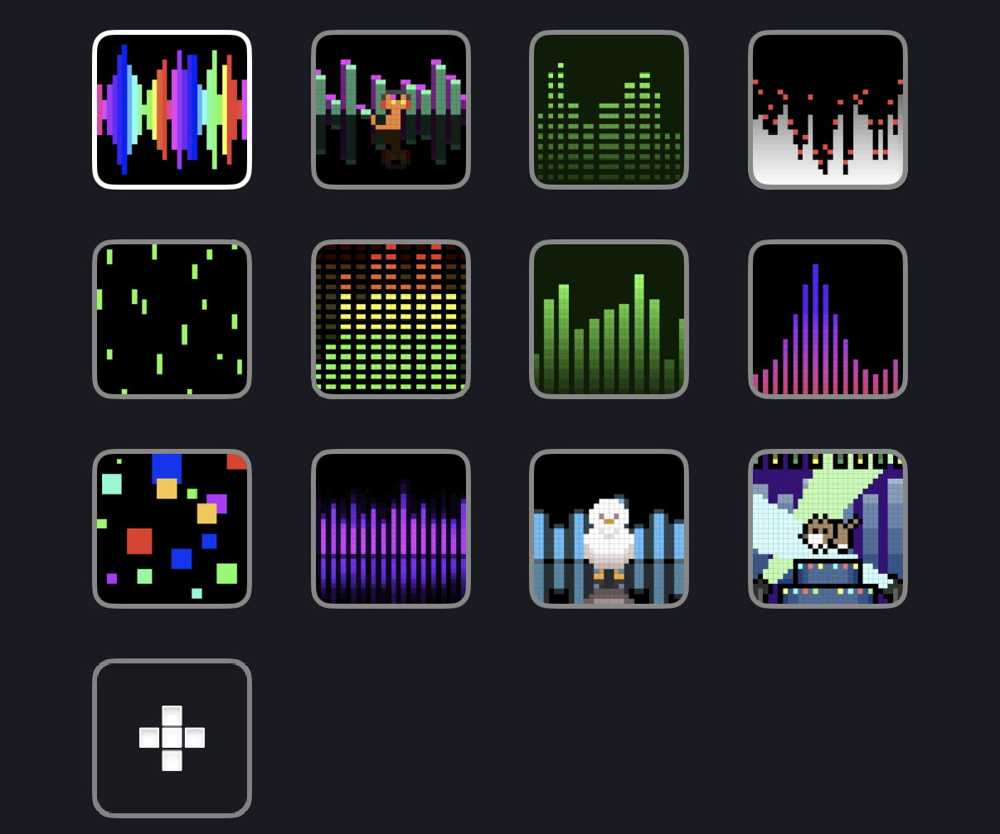
*The built-in visualizers as shown in the Divoom app, in order: `id: 0` top-left, then
left to right, top to bottom.*

| Field | Required | Values |
| --- | :---: | --- |
| `id` | Yes | Visualizer index, as shown in the Divoom app (starting from 0). |

```yaml
- name: Visualizer
  page_type: visualizer
  id: 2
```

### Page: Sound meter

Switches to the Pixoo's built-in sound meter tool (dB sound level measurement,
full-screen). No `id` field: there's only one. For a one-off trigger from a Shortcut
rather than a rotation page, see also the
[`start_sound_meter`/`stop_sound_meter`](#service-sound-meter-start_sound_meter--stop_sound_meter)
services.

```yaml
- name: Sound meter
  page_type: sound_meter
```

> ⚠️ Like the [timer](#service-timer-start_timer--stop_timer) and the
> [stopwatch](#service-stopwatch-start_stopwatch--pause_stopwatch--stop_stopwatch--reset_stopwatch),
> this tool takes over the whole screen. No need to stop it manually before moving to
> another page: any page change (rotation or `render_page` service) stops it
> automatically.

### Page: PV (solar)

Ready-to-use page for a solar/battery system — the battery icon and charge bar
automatically change color (red → orange → green) based on the level.

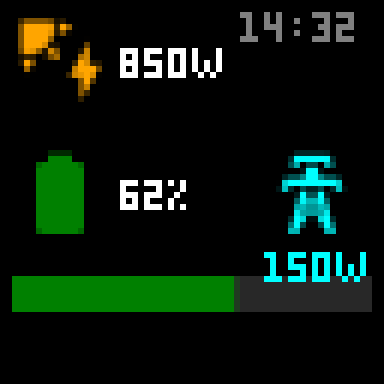
*Preview generated by the render engine (not a photo of a real device).*

| Field | Required | Default | Values |
| --- | :---: | :---: | --- |
| `power` | No | | Current power (displayed in W), raw or a template. |
| `storage` | No | | Battery level in % (0-100), colors the icon and bar. |
| `discharge` | No | | Discharge power (displayed in W) — only shown if set. |
| `time` | No | current time | Time displayed top-right. |

```yaml
- name: Solar
  page_type: pv
  power: "{{ states('sensor.solar_power') }}"
  storage: "{{ states('sensor.battery_level') }}"
  discharge: "{{ states('sensor.battery_discharge') }}"
```

### Page: Fuel (gas station)

Ready-to-use page to display up to 3 fuel prices.

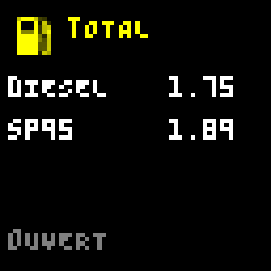
*Preview generated by the render engine (not a photo of a real device).*

| Field | Required | Default | Values |
| --- | :---: | :---: | --- |
| `title` | No | | Title at the top of the page, e.g. the station's name. |
| `name1`/`price1`, `name2`/`price2`, `name3`/`price3` | No | | Each pair is optional: a line is only shown if `name` or `price` is set. |
| `status` | No | | Free-form line at the bottom of the page, e.g. open/closed. |

```yaml
- name: Total station
  page_type: fuel
  title: Total
  name1: Diesel
  price1: "{{ states('sensor.diesel_price') }}"
  name2: SP95
  price2: "{{ states('sensor.sp95_price') }}"
  status: "{{ 'Open' if is_state('binary_sensor.station_open', 'on') else 'Closed' }}"
```

### Page: Pihole (ad blocker)

Ready-to-use page for a [Pi-hole](https://www.home-assistant.io/integrations/pi_hole/)
dashboard — inspired by
[kmplngj/pixoo-ha](https://github.com/kmplngj/pixoo-ha/blob/main/examples/page_templates/pihole_dashboard.yaml),
adapted to our components (`progress_bar` + `color_thresholds` instead of a manual
width/color calculation in Jinja). Like `pv`/`fuel`, most labels are icons or
numbers/units (`%`, `DNS`) rather than hardcoded words; the only free text (the small
label under the number of blocked ads) follows the language configured in Home
Assistant (`fr`/`en` for now, falling back to English otherwise) rather than always
being in French or English. Tested on a real device.

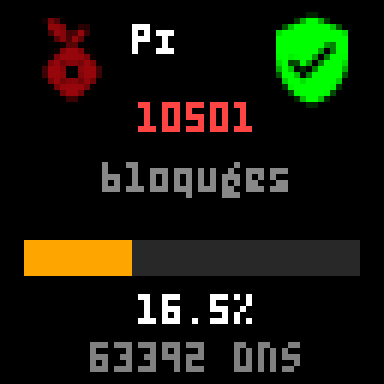
*Preview generated by the render engine (not a photo of a real device).*

| Field | Required | Default | Values |
| --- | :---: | :---: | --- |
| `blocked` | No | | Number of ads blocked, raw or a template. |
| `percentage` | No | | Block rate in % (0-100) — colors the bar (red → orange → green). |
| `queries` | No | | Number of DNS queries today — only shown if set. |
| `status_entity` | No | | `entity_id` of a `binary_sensor` (e.g. `binary_sensor.pi_hole_status`) — if set, adds a green/red shield depending on whether it's `on`/other. Unlike the other fields, this is a raw `entity_id`, not a template: the page builds the `is_state(...)` itself. |

```yaml
- name: Pi-hole
  page_type: pihole
  blocked: "{{ states('sensor.pi_hole_ads_blocked_today') }}"
  percentage: "{{ states('sensor.pi_hole_ads_percentage_blocked_today') | round(1) }}"
  queries: "{{ states('sensor.pi_hole_dns_queries_today') }}"
  status_entity: binary_sensor.pi_hole_status
```

### Page: Weather

Ready-to-use page for a native Home Assistant `weather.*` entity — the icon and its
color automatically change based on the condition (`sunny`, `rainy`, `cloudy`...).
Unlike `pv`/`fuel`/`pihole`, a single field is enough: temperature and humidity are
read directly from the entity (every HA weather platform exposes them as attributes),
so there's nothing else to configure for the common case.

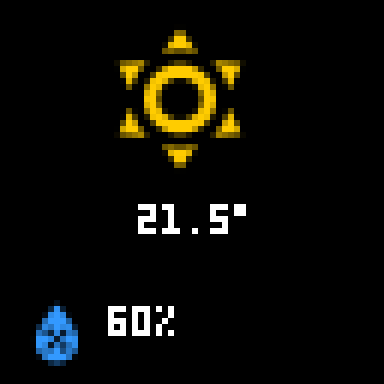
*Preview generated by the render engine (not a photo of a real device).*

| Field | Required | Default | Values |
| --- | :---: | :---: | --- |
| `entity` | Yes | | `entity_id` of a `weather.*` entity. Unlike other fields in this table, this is a raw `entity_id`, not a template: condition/temperature/humidity are read directly from it. |

```yaml
- name: Weather
  page_type: weather
  entity: weather.home
```

### Page: Battery (generic charge gauge)

Ready-to-use page for any entity whose state is a 0-100 charge percentage (robot
vacuum, synced phone, battery sensor...) — a circular gauge using the `arc` component,
colored by threshold (red → orange → green).

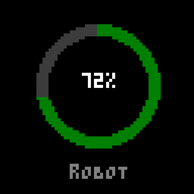
*Preview generated by the render engine (not a photo of a real device).*

| Field | Required | Default | Values |
| --- | :---: | :---: | --- |
| `entity` | Yes | | `entity_id` whose state is a 0-100 percentage. As with `weather`, this is a raw `entity_id`: the gauge's angle is calculated here in Python, not in Jinja. |
| `label` | No | | Free text displayed under the gauge (any language), e.g. `Robot`. |

```yaml
- name: Robot battery
  page_type: battery
  entity: sensor.vacuum_robot_battery
  label: Robot
```

## Automatic page rotation

Enable `switch.pixoo_page_rotation` to automatically cycle through every enabled page
(any whose `enabled` isn't `false`), in the order they appear in your config, each for
its `duration` (or the default duration set in the options if it doesn't specify one).
This rotation automatically resumes on Home Assistant restart if it was active before
shutdown.

## Service: render a page on demand

The `pixoo_canvas.render_page` service displays a page immediately, without waiting
its turn in the rotation:

```yaml
service: pixoo_canvas.render_page
data:
  device_id: <your Pixoo Canvas device>
  page: Temperatures
```

You can also pass it a page inline (without naming an existing page), for a one-off
display — handy for a notification. Without `page_type`, a list of `components` is
expected (the default):

```yaml
service: pixoo_canvas.render_page
data:
  device_id: <your Pixoo Canvas device>
  components:
    - type: rectangle
      position: [0, 0]
      size: [64, 64]
      color: black
    - type: text
      position: [2, 20]
      content: "Delivery arrived!"
      color: yellow
```

The other `page_type` values (`clock`, `channel`, `visualizer`, `sound_meter`, `pv`,
`fuel`) also work inline, by specifying `page_type` and that type's fields (see the
table above):

```yaml
service: pixoo_canvas.render_page
data:
  device_id: <your Pixoo Canvas device>
  page_type: clock
  id: 182
```

## Service: sound the buzzer

The `pixoo_canvas.play_buzzer` service sounds the Pixoo's built-in buzzer — handy for
an audible alert alongside a visual notification. ⚠️ Use sparingly: repeated/rapid use
could wear out the hardware.

```yaml
service: pixoo_canvas.play_buzzer
data:
  device_id: <your Pixoo Canvas device>
  active_time_ms: 500   # optional, default 500 — buzzer duration per cycle
  off_time_ms: 500      # optional, default 500 — silence between each cycle
  total_time_ms: 3000   # optional, default 3000 — total alert duration
```

## Service: reboot the device

The `pixoo_canvas.reboot_device` service reboots the Pixoo — useful in a recovery
automation (e.g. an unresponsive device), not as a routine action. The screen turns off
for a moment; rotation, if it was active, resumes on its own once the device is back
online. For a manual trigger from a dashboard or a shortcut, `button.pixoo_reboot` does
the same thing without going through a service call.

```yaml
service: pixoo_canvas.reboot_device
data:
  device_id: <your Pixoo Canvas device>
```

## Service: timer (start_timer / stop_timer)

The `pixoo_canvas.start_timer` and `pixoo_canvas.stop_timer` services control the
Pixoo's built-in timer tool — it takes over the whole screen until it's stopped or
another page/service takes over. If `switch.pixoo_page_rotation` is active,
`start_timer` automatically pauses it (without changing your on/off preference) so the
timer isn't overwritten on the next rotation turn; `stop_timer` resumes rotation only
if it was `start_timer` that had paused it. `stop_timer` works even without a prior
`start_timer` (handy for a "just in case" Shortcut) and always leaves the screen clean,
without the timer's frame lingering.

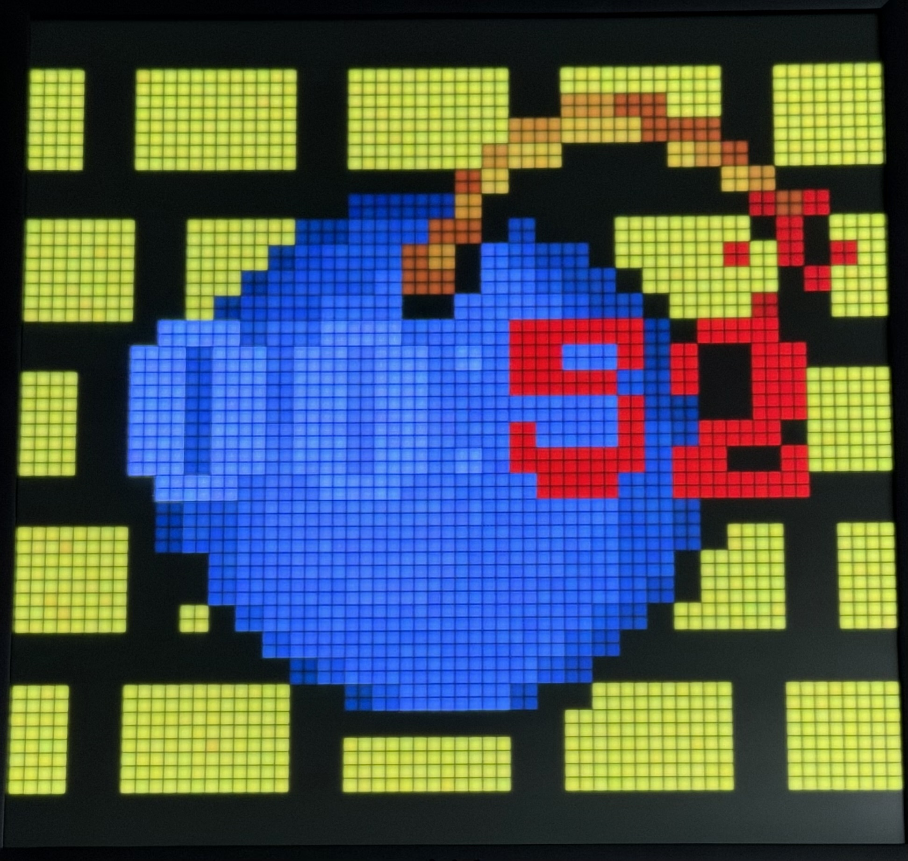
*Photo of a real device (timer at 90 seconds).*

```yaml
service: pixoo_canvas.start_timer
data:
  device_id: <your Pixoo Canvas device>
  minutes: 5   # optional, default 0 — minutes/seconds can't both be 0
  seconds: 30  # optional, default 0
```

```yaml
service: pixoo_canvas.stop_timer
data:
  device_id: <your Pixoo Canvas device>
```

> ⚠️ Confirmed on a real device (and in the Divoom app itself): stopping a running
> timer always resets the countdown to zero. Unlike the stopwatch, there's therefore no
> real pause for the timer — no way to freeze it mid-way and then resume the countdown
> where it left off.

**For an iOS Shortcut**: nothing special needed on the integration's side — the Home
Assistant Companion app natively exposes any HA service as a "Perform action" step in
the Shortcuts app. Create a shortcut with that step, choose `pixoo_canvas.start_timer`
(or `stop_timer`), fill in `device_id` (and `minutes`/`seconds` for starting), and add
it to your home screen or trigger it via Siri. For `device_id`: check
`sensor.pixoo_device_id`'s state (copy it from Settings → Devices & services → Entities,
or the entity's history) rather than digging it out of the device's page URL.

## Service: stopwatch (start_stopwatch / pause_stopwatch / stop_stopwatch / reset_stopwatch)

The `pixoo_canvas.start_stopwatch`, `pixoo_canvas.pause_stopwatch`,
`pixoo_canvas.stop_stopwatch` and `pixoo_canvas.reset_stopwatch` services control the
Pixoo's built-in stopwatch tool, in every way similar to the timer (see above): it
takes over the whole screen until it's stopped or another page/service takes over. No
field required besides `device_id` — the stopwatch simply counts up from zero.

`pause_stopwatch` and `stop_stopwatch` both stop the count, but with an important
difference: **`stop_stopwatch`** resumes `switch.pixoo_page_rotation` (if
`start_stopwatch` had paused it) and leaves the screen clean — the right choice once
you're done using the stopwatch, including when called directly without a prior
`start_stopwatch` (handy for a "just in case" Shortcut). **`pause_stopwatch`** does
neither: rotation stays paused and the stopwatch stays displayed, elapsed time frozen
on screen — use it when you plan to resume with `start_stopwatch` shortly after.

```yaml
service: pixoo_canvas.start_stopwatch
data:
  device_id: <your Pixoo Canvas device>
```

```yaml
service: pixoo_canvas.pause_stopwatch
data:
  device_id: <your Pixoo Canvas device>
```

```yaml
service: pixoo_canvas.reset_stopwatch
data:
  device_id: <your Pixoo Canvas device>
```

```yaml
service: pixoo_canvas.stop_stopwatch
data:
  device_id: <your Pixoo Canvas device>
```

## Service: audio visualizer (start_visualizer / stop_visualizer)

The `pixoo_canvas.start_visualizer` and `pixoo_canvas.stop_visualizer` services offer a
shortcut to switch to an [audio visualizer](#page-visualizer-audio-visualizer) without
building an inline page for `render_page` — handy for an iOS/Android Shortcut that only
needs to fill in an `id`. Same logic as the timer/stopwatch:
`start_visualizer` pauses `switch.pixoo_page_rotation` if it's active (without
changing your on/off preference); `stop_visualizer` restores the channel that was
displayed before starting and resumes rotation only if it was `start_visualizer` that
had paused it.

```yaml
service: pixoo_canvas.start_visualizer
data:
  device_id: <your Pixoo Canvas device>
  id: 2   # visualizer index, as shown in the Divoom app (starting from 0)
```

```yaml
service: pixoo_canvas.stop_visualizer
data:
  device_id: <your Pixoo Canvas device>
```

> ⚠️ `stop_visualizer` called without a prior `start_visualizer` (e.g. from a "just in
> case" Shortcut) does nothing: unlike the timer/stopwatch, the visualizer doesn't
> leave a trace of a channel to restore until `start_visualizer` has captured the
> active channel before it.

## Service: sound meter (start_sound_meter / stop_sound_meter)

The `pixoo_canvas.start_sound_meter` and `pixoo_canvas.stop_sound_meter` services
control the Pixoo's built-in [sound meter](#page-sound-meter) with the same ergonomics
as the timer/stopwatch: `start_sound_meter` pauses `switch.pixoo_page_rotation` if it's
active, and `stop_sound_meter` restores the channel that was displayed before starting
and resumes rotation only if it was `start_sound_meter` that had paused it. No field
required besides `device_id`.

```yaml
service: pixoo_canvas.start_sound_meter
data:
  device_id: <your Pixoo Canvas device>
```

```yaml
service: pixoo_canvas.stop_sound_meter
data:
  device_id: <your Pixoo Canvas device>
```

## License

MIT — see [LICENSE](LICENSE).
